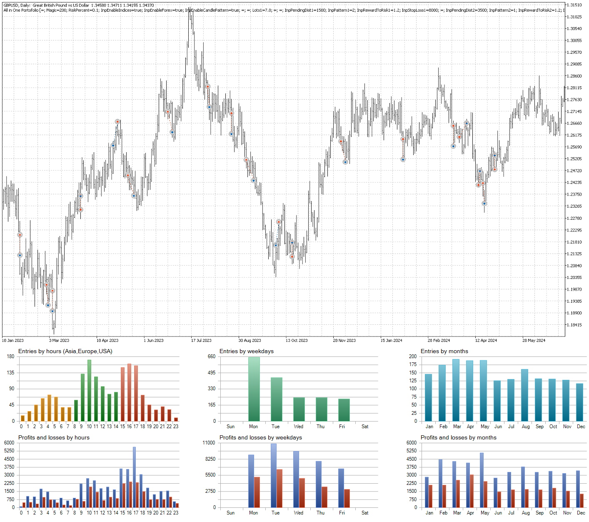

## Let the Math Do the Heavy Lifting for You.

### Published Articles and Projects
* [Machine Learning Stock Backtesting Framework](https://github.com/handiko/machine-learning-stock-backtesting)
* [Market Maker Simulator](https://handiko.github.io/market-maker-sim/) --- its explanation:[here](https://github.com/handiko/market-maker-sim/blob/main/README.md)
* [USDT-IDR Monitoring Dashboard](https://github.com/handiko/USDT-IDR-Monitoring-Dashboard/blob/main/README.md)
* [Treasury Monitoring Terminal](https://github.com/handiko/treasury-terminal/blob/main/README.md)
* [Basic Understanding of Markov Chain in Financial Market](https://github.com/handiko/Markov-Chain-In-Financial-Market/blob/main/README.md)
* [Using Markov chain to analyze first insight of a forex pair, index, or any market](https://github.com/handiko/Markov-Chain-UpDown-Day/blob/main/README.md)
* [Using a Markov chain to determine market risk](https://github.com/handiko/Markov-Chain-In-Financial-Market-Risk/blob/main/README.md)
* [Trading Strategy Development Example](https://github.com/handiko/Trading-Strategy-Development-Example/blob/main/README.md)
* [Trading Strategy Improvement](https://github.com/handiko/Improvement-to-an-existing-strategy/blob/main/README.md)
* [Multi-Criteria Optimal Portfolio Allocation using Monte Carlo](https://github.com/handiko/Optimal-Portfolio-Allocation/blob/main/README.md)
* [Quantitative-Fund Portfolio Simulation and Analysis](https://github.com/handiko/Quantitative-Fund-Portfolio-Performance-Simulation-and-Analysis/blob/main/README.md)
* [RSI-2 Stock Strading Strategy](https://github.com/handiko/RSI-2-Stock-Trading-Strategy/blob/main/README.md)
* [Portfolio Trading Strategy Backtester](https://github.com/handiko/RSI-2-Portfolio-Trading-Strategy-Backtester/blob/main/README.md)
* [Which Pair does Mean-Reversion? (Augmented Dickey-Fuller Test)](https://github.com/handiko/ADF-Test-Forex/blob/main/README.md)
* [RSI-2 Trading Strategy - Pinescript version](https://github.com/handiko/RSI-2-Stock-Trading-Strategy-Pinescript/blob/main/README.md)
* [Market Seasonality Chart Generator](https://github.com/handiko/Market-Seasonality-Chart-Generator/blob/main/README.md)
* [Monthly Seasonality Trading Strategy Backtest](https://github.com/handiko/Monthly-Seasonality-Trading-Strategy-Backtest/blob/main/README.md)
* [Price Data Downloader and Converter](https://github.com/handiko/Price-Data-Downloader-and-Converter/blob/main/README.md)
* [Polymarket Market Finder](https://github.com/handiko/Polymarket-Market-Finder/blob/main/README.md)
* [The Infinite Needle: An Exercise in Cryptographic Futility](https://github.com/handiko/Dumb-Way-to-Find-a-Funded-Wallet/blob/main/README.md)

