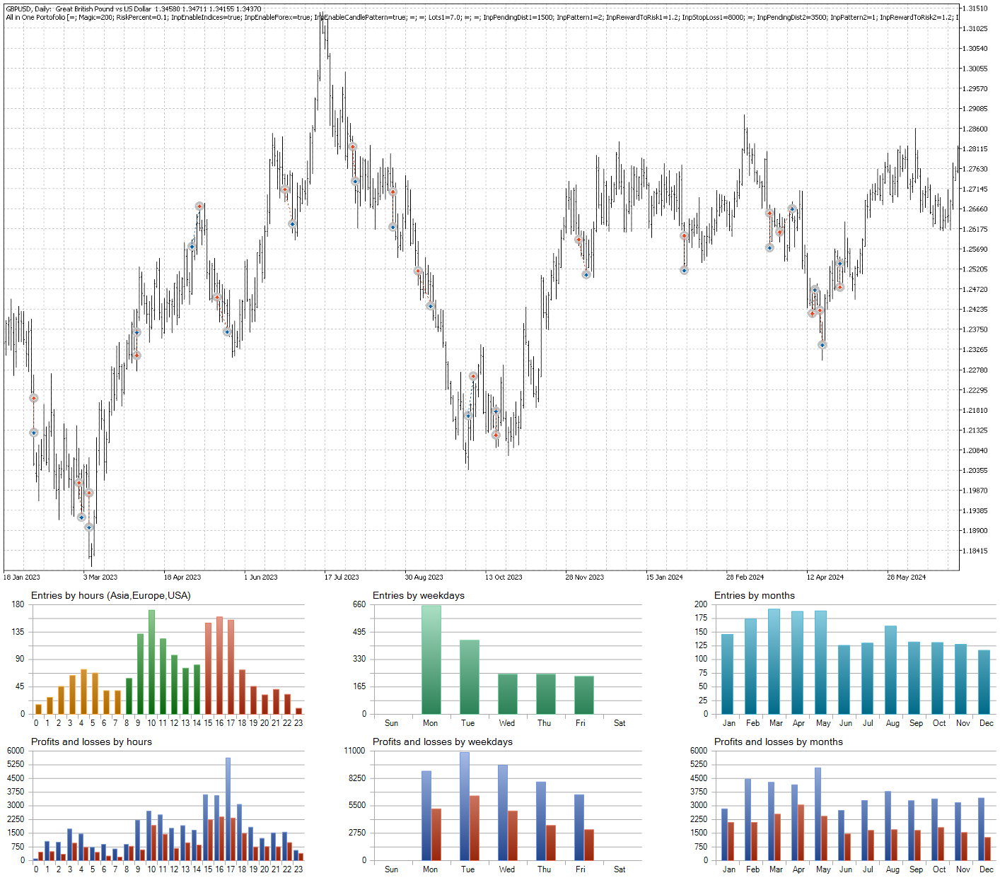
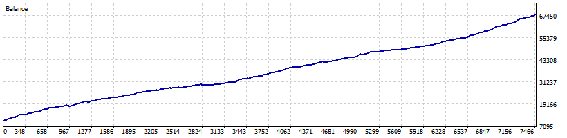
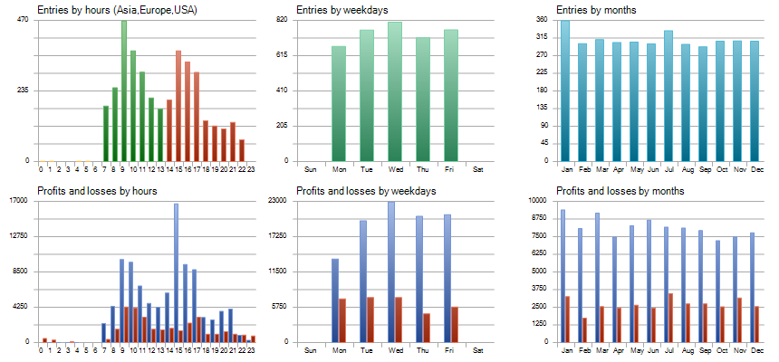
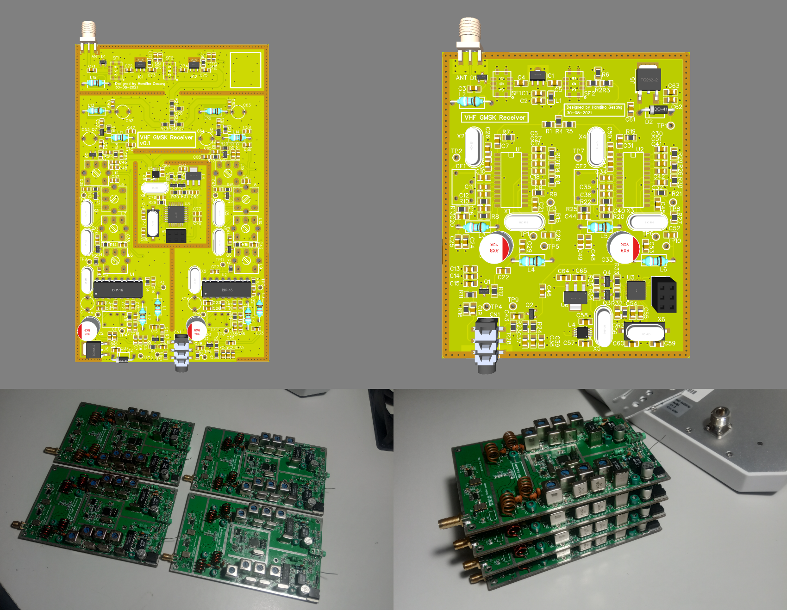

## Let the Math Do the Heavy Lifting for You.

<!--
### Hi there 👋

### Handiko Gesang Anugrah Sejati, S.T.
I work primarily as a RF Engineer/RF Specialist who designed board-level RF Circuits for HF to Low-UHF range (3 MHz - 470 MHz). Occasionally, I posts articles on my website.
* Personal website: [https://handiko.github.io/](https://handiko.github.io/)
* How to contact me: [handikogesang@gmail.com](handikogesang@gmail.com)

### Primary Interest 🔭
* **Software Defined Radio (SDR)**, I am quite proficient in using GNU Radio tools and already made a few of Out-of-tree modules [here](https://handiko.github.io/gr-HDLC-AFSK/) and [here](https://github.com/handiko/CurriculumVitae).
* **Antenna and RF Design**, I am experienced in designing and simulating various antenna using free software, like 4NEC-2 and MMANA-GAL. A few of the design results [1](https://handiko.github.io/4E-20M-YAGI/), [2](https://handiko.github.io/Rotary-WARC-Band-Dipole/), [3](https://handiko.github.io/3E-40M-YAGI/), [4](https://handiko.github.io/Portable-Yagi-10-15-2E/), [5](https://handiko.github.io/Yagi-4E-144/)
* **RF Data Telemetry & Data Communication**, I designed a hardware and wrote code and GNU Radio module to make an APRS Transmitter using an Arduino UNO and APRS receiver on GNU Radio using RTL-SDR [1](https://handiko.github.io/Arduino-APRS/), [2](https://handiko.github.io/Dorji-TX-Shield/), [3](https://handiko.github.io/gr-APRS/)
* **Algorithmic Forex Trading**, I recently start to trade forex and written a forex swing trading strategy in MQL5 and Pinescript programming language. [Trading Strategy Collections](https://handiko.github.io/TradingStrategy-Public/)

### Side Projects ⚡
* **I own my private Amateur Radio Station**, My Callsign is YC1SDL. Currently i am still upgrading my antenna system for 40m band (7 MHz).
<!--* **I made and sell Amplifier Relay Buffer - RB-1A**, This product is used as an interface between amateur radio equipment and various of high power linear amplifier [here](https://handiko.github.io/MyBlog/2020-04-29/2020-04-29.html).
* **I made and sell RF Noise Canceller - NCL-100+**, This product is used as a tool for noise reduction based on signal cancelation [here](https://handiko.github.io/MyBlog/2020-08-01/2020-08-01.html).
-->

<!--
### I'm Currently Learning 🌱
* **RF Filter Design Techniques**, Primarily interested in low-cost HF-VHF RF Filter (Bandpass, Lowpass, ect.)
* **Antenna Array Design**, To improve my amateur radio station capabilities.
* **Another Noise Cancelling Techniques**, To improve/upgrade my NCL-100+ Noise Canceller capabilities.
* **Low Noise RF Amplification**
* **Algorithmic Forex Trading**

-->

<!--

**handiko/handiko** is a ✨ _special_ ✨ repository because its `README.md` (this file) appears on your GitHub profile.

Here are some ideas to get you started:

- 🔭 I’m currently working on ...
- 🌱 I’m currently learning ...
- 👯 I’m looking to collaborate on ...
- 🤔 I’m looking for help with ...
- 💬 Ask me about ...
- 📫 How to reach me: ...
- 😄 Pronouns: ...
- ⚡ Fun fact: ...
-->
